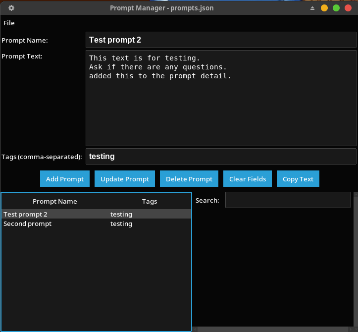

# DescAI

### a GUI desktop AI client  
>#### Converse with cloud and local based LLMs 
>##### Openai Google anthropic Ollama Groq Deepseek

-  Temporary local Chat Mode
-  Supports a variety of OpenAI models and web-search
-  Supports web-search for some models
-  Convert responses to HTML or VOICE
-  Maintains a log of reponses
-  Simple GUI
-  Renders HTML from Markdown
-  Choose from many themes and colors
-  Pop-up Prompt Manager and Options Manager
-  RAG for .pdf .md .txt documents

_requires modules_  

        anthropic
        openai
        google-genai
        ollama
        Markdown
        ttkbootstrap==1.14.2
        groq
        langchain 
        langchain-community
        langchain-text-splitters 
        langchain-ollama 
        langchain-core
        faiss-cpu

_Uses Python and tkinter_

>python3  
>python3-tk
Ollama (see website to download)

aditional requirements:

        text editor
        
        VNC media player
        
        Internet and Internet browser

**Tested on Windows and Linux**

----

## Instalation

Use `pip` or `pip3` to install any missing python modules
needed for API access. Consult the vendor for
the correct `pip...` syntax.

Also you will need **_API keys_** from each vendor.  
The vendors offer both free and paid tiers.  
Here are the vendors, websites, and key labels to use in your environment:

| Vendor | Website | ENVariable | 
| :--- | :--- | :--- |
| OpenAI | https://platform.openai.com | **GPTKEY** |
| Anthropic | https://claude.ai/settings | **CLDKEY** |
| Google | https://aistudio.google.com | **GGLKEY** |
| Ollama | https://ollama.com/settings | **OMAKEY** |
| groq | https://console.groq.com/keys | **GRQKEY** |
| Deepseek | https://platform.deepseek.com | **DSKKEY** |

Windows and Linux have their own way to set these variables.

### Local Models

Local models are installed using Ollama.  
Visit the Ollama website for instructions on installing Ollama and downloading local models.

[Ollama website](https://ollama.com "Ollama")

---

## Voice

If you plan to use Voice reading of responses, you will need to install VLC media player.

Use Ctrl-Shift-S to play back the reponses.

Each play-back is saved in a separate file in the application directory.

---

## Models File `models.dat`

        gemma4:e2b-local
        gemma4:e4b-local
        groq/compound
        gpt-5.4-mini
        gpt-5.4-nano
        gpt-5-mini
        gpt-5-nano
        gemini-3.1-flash-lite-preview
        gemini-2.5-flash-lite
        gemini-2.5-flash
        gemini-2.5-pro
        claude-haiku-4-5
        claude-sonnet-4-6
        claude-opus-4-6
        gpt-4.1-mini
        gpt-4.1-nano
        gpt-4o-mini
        gpt-5
        gpt-5.4
        qwen3-coder:480b-cloud
        qwen3.5:397b-cloud
        deepseek-chat
        deepseek-reasoner
        rag_deepseek-r1:8b
        rag_gemma4:e4b
        rag_gemma4:e2b

**Note:**  
    for **local** models obtained from Ollama append the model name with `-local`  
    for **cloud** models obtained from Ollama append the model name with `-cloud`  
    Only Ollama local models are used with RAG. Prepend those with `rag-`  
    Modify this file for what ever models you use.

---

## RAG

Workflow is slightly different for RAG. 

1. select the rag-_model_ to use
2. You are prompted to locate the directory containing your documents
3. Wait while the documents are converted and built into the vector database
4. prompt, get results, logging all the same as none RAG process.

---

## Options

The `options.ini` file contains all of the options settings.

There is a GUI that handles options but can use a text editor also.  

---

## Buttons

- **New**
> Begins a new conversation  
>>To change the system instructions message for the current session,  
type **_instruct_ You are a .......... assistant**  
into the Prompt Area first, and then click "New".
- **View**
> Displays the log file you named in Options.
- **Text**
> Opens the current response or selection in your text editor   
Set up the name of your text editor in _options_.
- **Html**
> Converts the current response or selection to HTML
and opens it in your default browser.
- **Options**  
> launches the Options editing program
- **Submit Query**
> Submits prompt to the current AI Model
>> Ctrl-G and Ctrl-Enter do that too.
- **Web**
> Toggle the "**web**-search" tool
>> **NOTE:** works with most OpenAI models,  
>> Claude Sonnet, Claude Opus, and groq/compound
- **Select _temporary_ Model**
> Select from models listed in `models.dat` text file  
Selecting a different model forces a new conversation
>> _On startup the "default" model is always selected_  
The default model is set in options (`options.ini`)
- **Close**
> Exit the program. _Ctrl-q_ exits the program without confirmation.

---

## Context menu

Right-Click in the prompt or response area to get a bunch of useful choices.

---

### Setting options from the app

## Operation

At startup, if a previous conversation is detected the user is prompted
to either continue or start a new conversation. So closing the app does
not terminate a conversation. To start a new conversatioin while
the app is running use the **'New'** button. Multiple conversations are not
preserved anywhere, but will remain in the log until it is purged.

## Hot Keys

| key | action |
| :--- | :--- |
|__Ctrl-H__| This HotKey help|
|__Ctrl-Q__| Close Program No Prompt|
|__Ctrl-Shift-D__| Delete Log File|
|__Ctrl-Shift-S__| Speak the Currrent Text|
|__Ctrl-G__| Submit Query (Button)|
|__Ctrl-Enter__ | Submit Query (Button)|
|__Ctrl-F__| Find text |
|__Ctrl-N__| Find next text |
|__Ctrl-J__| Open Selected URL |
|__Ctrl-R__|Clear Prompt Area|
|__Alt-P__|Open Prompt Manager (or right-click) |

The `prompts` directory is for storing custom prompt text.
Prompt files must begin with "prompt" and be followed by non-space characters, like `prompt1` or `promptX`.
You can easily edit your prompt?.md files with a text editor.

In addition, a _Prompts Viewer_ presents named prompts that are created and modified in a file
called `prompts.txt`. Access the viewer with Alt-P or with the Right-Click drop-down.

----

END
